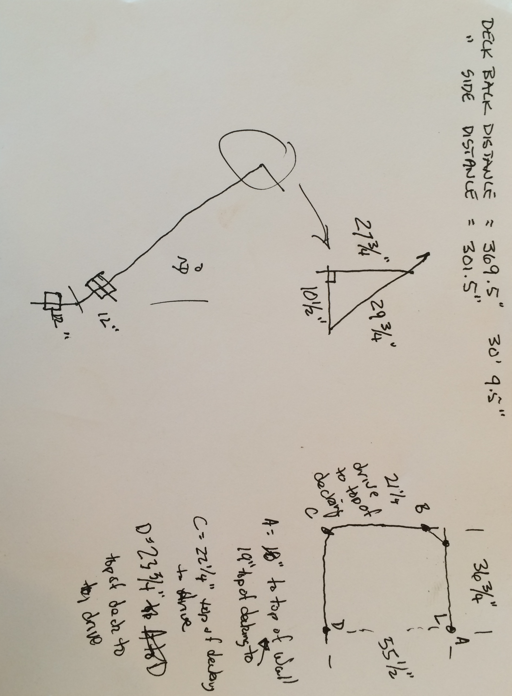
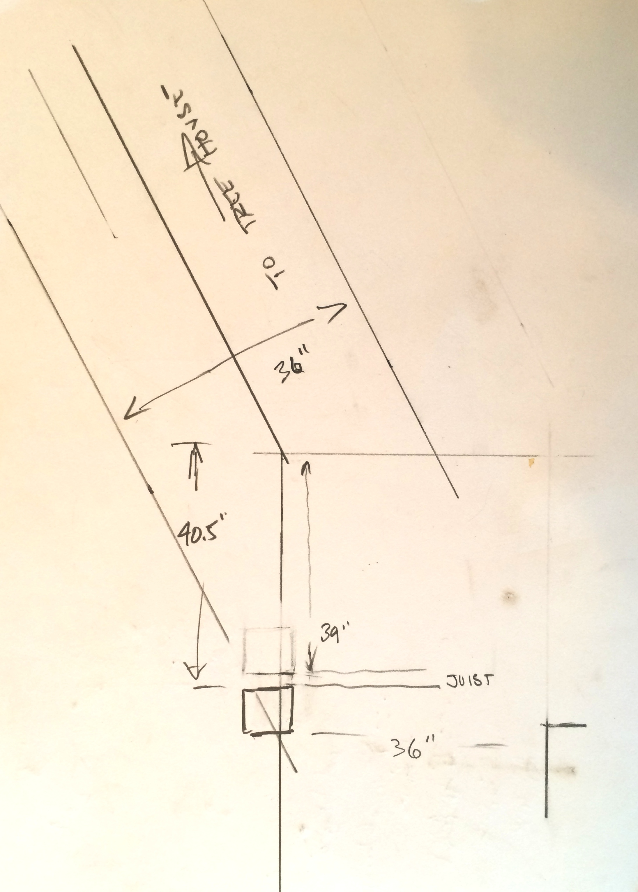

# Deck Walkway

Notes on the railings for the deck walkway.

## Next Steps

- [ ] Mount Railing Posts From Cooking Deck To Corner
- [ ] Design Steps
- [ ] Layout Posts For Side Of House
- [ ] Mount Railing Posts for Side Walkway
- [ ] Mount Secret Room Balcony Posts
- [ ] Mount Master Bedroom Balcony Posts
- [ ] Mount Loft Balcony Posts
- [ ] Order Remaining Lumber

## Back Railing Notes and Measurements

The back railing has two segments:

- Back Cooking Deck to Turn
- Turn to Corner of the House

The turn does not provide a good mounting point for a railing post because of the faceboards joining and sistered joists right at the turn. For this reason, the turn will have a post 12" on each side of turn point. There is good clearance for the posts centered at the 12" from turn point. This will require a special railing segment with a turn and should not be a problem.

Measurements:

- Turn to Face Board End: 30' 9.5" (369.5")
- Turn Angle: 30°
- Tree House Angle: 20.667° (Based on 27.75", 10.5", 29.75" right triangle)

### End Post Positions
The end post positions are identified as follows:
- From the turn, the post face will start at 12.0" - PostWidth/2.0 = 10.25"
- From the corner, the post face will start at 40.5"

The corner post is setback 40.5" to get be next to a joist and to be at a good position to intersect with the walkway to the treehouse based on the expected angle.

Given 369.5" - 10.25" - 40.5" = 318.75" = Railing Distance Including End Post Widths
Or 318.75" - PostWidth = 315.25" End Post Centerline Distance

Distance between posts if divided by 3 = 105.083". The actual span is 101.583" or 8' 5.583". This should not be a problem to meet codes for strength.

Post Centerlines Are:
- Corner End Post: 42.25"
- Post 1: 147.333"
- Post 2: 252.417" Note: Falls directly in middle of joist. :(
- Turn End Post: 357.5"

## Measurement Notes

